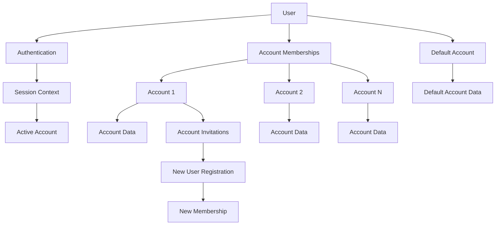
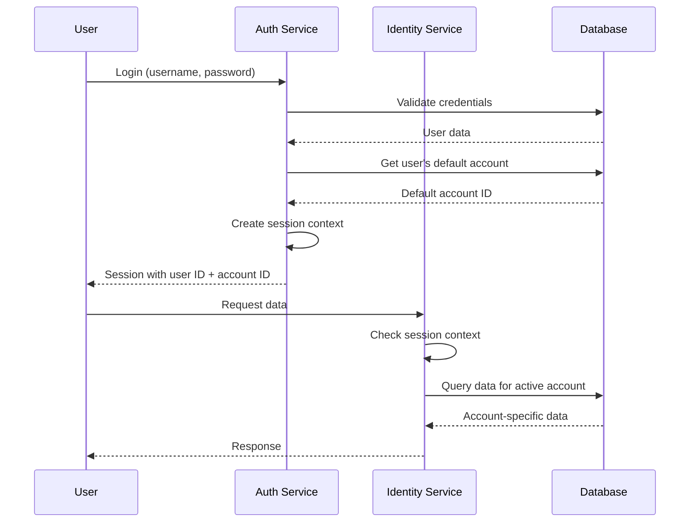

# Identity System Documentation

This document describes the identity and authentication system used in this application. The system is built around three core concepts: **Users**, **Accounts**, and **Account Memberships**.

## Core Concepts

### Users

Users represent individual people in the system. Each user has:

- A unique identifier (`ID`)
- Authentication credentials (username, email, password)
- Personal information (first name, last name, birthday)
- A service-level role (admin, user, etc.)
- Account status (active, banned, terminated)

**Domain Definition**: [`internal/domain/identity/user.go`](internal/domain/identity/user.go)

### Accounts

Accounts represent organizations or groups that users can belong to. Most data in the system is associated with accounts rather than individual users. Each account has:

- A unique identifier (`ID`)
- A name and contact information
- A billing status
- A webhook encryption key
- A list of members

**Domain Definition**: [`internal/domain/identity/account.go`](internal/domain/identity/account.go)

### Account Memberships

Account memberships define the relationship between users and accounts. Each membership has:

- A unique identifier (`ID`)
- A user ID (`BelongsToUser`)
- An account ID (`BelongsToAccount`)
- An account role (admin or member)
- A flag indicating if this is the user's default account

**Domain Definition**: [`internal/domain/identity/account_user_membership.go`](internal/domain/identity/account_user_membership.go)

## Data Ownership Model

The system uses a clear data ownership model where most data is associated with accounts rather than individual users. This is indicated by the presence of `BelongsToUser` or `BelongsToAccount` fields in data structures.

**Examples**:

- User profile data: `BelongsToUser`
- Account settings: `BelongsToAccount`
- Webhooks: `BelongsToAccount`

## Authentication and Session Management

**For a complete description of the auth flow, including password, passkey, SSO, OAuth2, and gRPC interceptor behavior, see [auth-flow.md](auth-flow.md).**

### Token-Based Authentication

The system uses token-based authentication with JWT and PASETO support (PASETO is currently configured). Sessions are not stored server-side but are persisted through tokens.

### Authentication Flow (Summary)

1. User provides credentials (username/email + password + TOTP if 2FA is enabled), or uses passkey/SSO
2. System validates credentials and retrieves user information
3. System issues a token (JWT/PASETO) containing user ID and account information
4. Client uses this token to obtain OAuth2 credentials via the OAuth2 exchange process (web app) or sends JWT directly (some clients)
5. All subsequent gRPC requests use Bearer token (OAuth2 access token or JWT)

### OAuth2 Integration

The system implements OAuth2 for service authentication:

- **Authorization Endpoint**: `/oauth2/authorize`
- **Token Endpoint**: `/oauth2/token`
- Clients authenticate via `Authorization` header in gRPC requests
- HTTP endpoints only support OAuth2 flow (legacy HTTP auth routes should be deprecated)

**OAuth2 Implementation**: [`pkg/client/client.go:WithOAuth2Credentials`](pkg/client/client.go)

### Session Context

The session context contains:

- User information (ID, username, email, account status)
- Active account ID (initially the default account)
- Account permissions map (role for each account the user belongs to)
- Service-level permissions

**Domain Definition**: [`internal/authentication/sessions/session_context.go`](internal/authentication/sessions/session_context.go)

### Two-Factor Authentication (2FA)

- All users are issued a TOTP secret during registration
- Users must verify their TOTP secret by submitting a valid TOTP code with their current password
- Once verified, TOTP is required for all login attempts
- Passwords are hashed using scrypt before storage

### Admin-Only Login

The system supports a special admin-only login mode that has stricter requirements:

1. **Service Role Restriction**: Only users with `service_role = 'service_admin'` can use admin login
2. **2FA Requirement**: Admin login **requires** a valid TOTP token (6-digit code)
3. **Verified 2FA**: The user must have a verified 2FA secret (`two_factor_secret_verified_at IS NOT NULL`)
4. **Database Query**: Uses `GetAdminUserByUsername` instead of `GetUserByUsername` which includes additional filters

**Key Differences from Regular Login**:

- Regular users can have unverified 2FA secrets and login without TOTP
- Admin login **always** requires TOTP validation
- Admin login only works for users with service admin privileges
- Admin login uses a separate database query with stricter filtering

**Implementation**: [`internal/authentication/manager.go:ProcessLogin`](internal/authentication/manager.go) and [`internal/services/auth/handlers/authentication/authentication_http_routes.go:BuildLoginHandler`](internal/services/auth/handlers/authentication/authentication_http_routes.go)

### Logout

There is currently no server-side logout mechanism. Tokens expire naturally, and logout is handled client-side by discarding stored OAuth2 credentials.

## Account Roles and Permissions

The system has two account-level roles and two service-level roles:

### Account-Level Roles

- **Account Member**: Basic access to account data, can perform standard operations within the account
- **Account Admin**: All member permissions plus ability to modify account settings, invite/remove members, transfer account ownership, and manage account-level resources

### Service-Level Roles

- **Service User**: Can create webhooks and read information about accounts they're part of
- **Service Admin**: Can run workers arbitrarily and publish arbitrary messages to queues

**Note**: Account-level roles govern access to account-owned resources. Future plans include switching from string-based roles to bitmask-based roles for better performance and flexibility.

**Permission System**: [`internal/authorization/account_role.go`](internal/authorization/account_role.go)

The permission system uses a hierarchical model where admins inherit all member permissions:

```go
// From internal/authorization/rbac.go
must(rbac.SetParent(AccountAdminRoleName, AccountMemberRoleName))
```

## Account Creation and User Registration

### Standard Registration

When a user registers without an invitation:

1. User account is created
2. A default account is automatically created for the user
3. User is made an admin of their default account
4. This account becomes their default account

### Registration with Invitation

When a user registers with an invitation token:

1. User account is created
2. User is added to the invited account as a member
3. The invitation is marked as accepted
4. A default account is still created for the user
5. The invited account becomes their default account

## Account Invitations

### Invitation Types

1. **Email-based invitations**: Sent to a specific email address
2. **Token-based invitations**: Created with a token that can be used during registration

### Invitation Process

1. Account admin creates an invitation
2. Invitation can be sent via email or shared as a token
3. When a user registers with the invitation token, they're automatically added to the account
4. If the invitation was sent to an email, it's automatically associated when that email registers

**Domain Definition**: [`internal/domain/identity/account_invitation.go`](internal/domain/identity/account_invitation.go)

## Account Switching

Users can switch between accounts they're members of:

1. User requests to switch to a different account via the `SetDefaultAccount` gRPC method
2. System validates the user is a member of that account
3. The account is permanently set as the user's default account
4. All subsequent requests use the new account context

**TODO**: The current implementation permanently changes the default account. Consider implementing session-based account switching that doesn't permanently change the user's default account.

## Account Membership Management

### Removing Users from Accounts

Users can be removed from accounts by account admins. When a user is removed:

1. Their membership is archived
2. If they have no remaining accounts, a new default account is created
3. If they have remaining accounts, one is set as their new default

**Important**: Users cannot remove themselves from accounts - this must be done by an account admin.

## System Architecture



## Key Data Flow



⚠️ **Important Clarifications**:

- When a user registers with an invitation, they're added as a **member** (not admin) of the invited account
- The invited account becomes their default account, but they still get their own personal account created
- Account switching **permanently** changes the user's default account (not just the active session account)
- The system uses token-based authentication with OAuth2, not traditional server-side sessions
- All users have 2FA secrets but must verify them before 2FA becomes required

## Security Considerations

1. **Token-Based Authentication**: Uses JWT/PASETO tokens with OAuth2 for service authentication
2. **Password Security**: Passwords are hashed using scrypt before storage
3. **Two-Factor Authentication**: TOTP-based 2FA is available and can be required for login
4. **Permission Checking**: Every request validates the user has access to the active account
5. **Account Isolation**: Data is strictly isolated by account membership
6. **Self-Removal Prevention**: Users cannot remove themselves from accounts to prevent lockout
7. **Default Account Guarantee**: Users always have at least one account (their personal account)

## Known Issues and TODOs

### Critical Issues

- **TODO**: If a user's default account is deleted, the system likely breaks. Need to implement proper handling for this scenario.

### Future Improvements

- **TODO**: Switch from string-based roles to bitmask-based roles for better performance and flexibility
- **TODO**: Implement session-based account switching that doesn't permanently change the user's default account

### gRPC Services

- **Auth Service**: [`internal/services/auth/grpc/`](internal/services/auth/grpc/) - Authentication and authorization
- **Identity Service**: [`internal/services/identity/grpc/`](internal/services/identity/grpc/) - User and account management

## Related Files

- **Domain Models**: [`internal/domain/identity/`](internal/domain/identity/)
- **Authentication**: [`internal/services/auth/`](internal/services/auth/)
- **Authorization**: [`internal/authorization/`](internal/authorization/)
- **Session Management**: [`internal/authentication/sessions/`](internal/authentication/sessions/)
